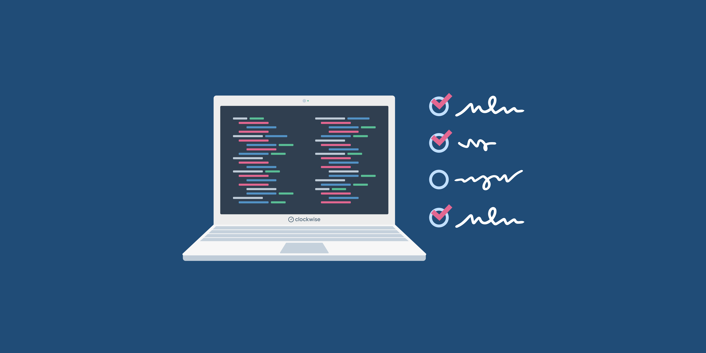
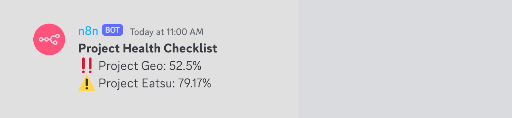

Project Health Checklist
========================

**Mechanics:**
- All projects start off as **"Unhealthy"** `‼️`
- Every week Projects are automatically scanned on Github and those that are **Unhealthy** `‼️` and **Getting There** `⚠️` will be announced and tagged in `#Devs` chat channel.
- In order to be **Healthy** `🟢`, project team must complete the checklist to at least **90%**.
- Upon **4** Consecutive tag on the chat channel, project team will be required to schedule a checklist review with the Engineering Lead within **4** days to understand how to address the issues and set a target date for checklist completion.
- A status badge will be added on the Project repository for quick checking of its health status (including date of last check). (Status: **Unhealthy** `‼️`, **Getting There** `⚠️` - 70%+, **Healthy** `🟢` 90%+ Checklist) and is automatically updated to the latest status every week.
- All checklist updates and changes will be done via an update to the project `README.md` and is PR'd to the main working branch.
- For Healthy projects, a `monthly automatic health check notification` will be done on the `#Devs` chat channel and a review will be scheduled with the Engineering Lead to ensure the project is still healthy - otherwise the project will be marked as **Unhealthy** `‼️` or **Getting There** `⚠️`

### Documentation and Readability:
- [ ] Is the project documentation up-to-date for running the app?
- [ ] Is the project's Readme still relevant?
- [ ] Are the .env templates updated to the latest version?
- [ ] Is the development environment configuration stored securely in Symph Password Manager and kept up-to-date?
- [ ] Are all code comments accurate and helpful?

### Development Environment and Setup:
- [ ] Are there clear instructions for setting up the development environment?
- [ ] Does the app include a Docker container for easy local deployment?
- [ ] Are development and testing environments properly separated (DEV & STAGING)?
- [ ] Are the main and development branches protected with Github Branch Protections?
- [ ] Is there a Github action set up to run sanity checks before merging a pull request?
- [ ] Is there a linting setup for the project?
- [ ] Is there a pre-push hook configured to run tests before pushing to the remote repository?
- [ ] Does the project adhere to the latest LTS or Current Version of the Code Runtime (e.g. Node.js)?
- [ ] Is there a clear and well-defined Git workflow?

### Security and Quality Assurance:
- [ ] Are proper loaders/loading components implemented in the app? (For all main pages at least)
- [ ] Are proper error boundaries implemented in the app? (For all main pages at least)
- [ ] Are empty states implemented where necessary?
- [ ] Is secrets management implemented securely? (Google Secrets Manager, Azure Secrets, etc.)
- [ ] Does the app pass Snyk Scans? (No High/Criticals/Mediums)
- [ ] Does the code maintain at least 80% Sonar Cloud Code Coverage?
- [ ] Are there no Critical/Blocker/Major Vulnerability Issues reported in Github and Sonar Cloud?
- [ ] Are there automated tests covering critical functionality and components?
- [ ] Is there a CI pipeline for automated builds and testing (e.g., Github Actions, Cloud Build, Azure DevOps)?
- [ ] Are unnecessary console logs and debug logs removed?
- [ ] Are API routes appropriately protected, ensuring only public routes are accessible?
- [ ] Are dependencies and third-party libraries updated to their latest versions?

### Reliability and Disaster Recovery:
- [ ] Is there a clear project ownership structure? (Know who to ask for help should issue arises)
- [ ] Is there a disaster recovery plan in place for critical failures or data loss (Database and Storage)?
- [ ] Is there a monitoring and alerting system (e.g., Sentry) to detect and respond to issues?
- [ ] Is there a system for regular data backups?
- [ ] Are there clear procedures for handling and reporting incidents?